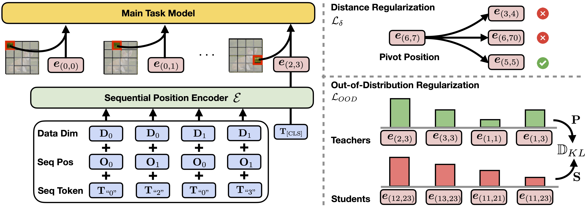

Code for the SeqPE project. Please visit `image_seqpe` and `text_seqpe` for 2D and 1D experiments, respectively. 

Please refer to [our paper](https://arxiv.org/pdf/2506.13277) for more details and experiment results.


## Methods

<p align="center" width="100%">

</p>


## Citation
```
@misc{li2025seqpetransformersequentialposition,
      title={SeqPE: Transformer with Sequential Position Encoding}, 
      author={Huayang Li and Yahui Liu and Hongyu Sun and Deng Cai and Leyang Cui and Wei Bi and Peilin Zhao and Taro Watanabe},
      year={2025},
      eprint={2506.13277},
      archivePrefix={arXiv},
      primaryClass={cs.LG},
      url={https://arxiv.org/abs/2506.13277}, 
}
```
